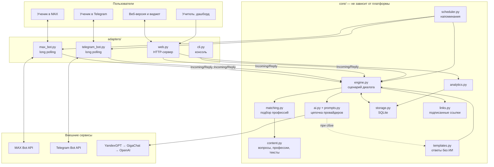
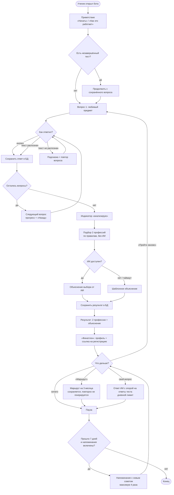
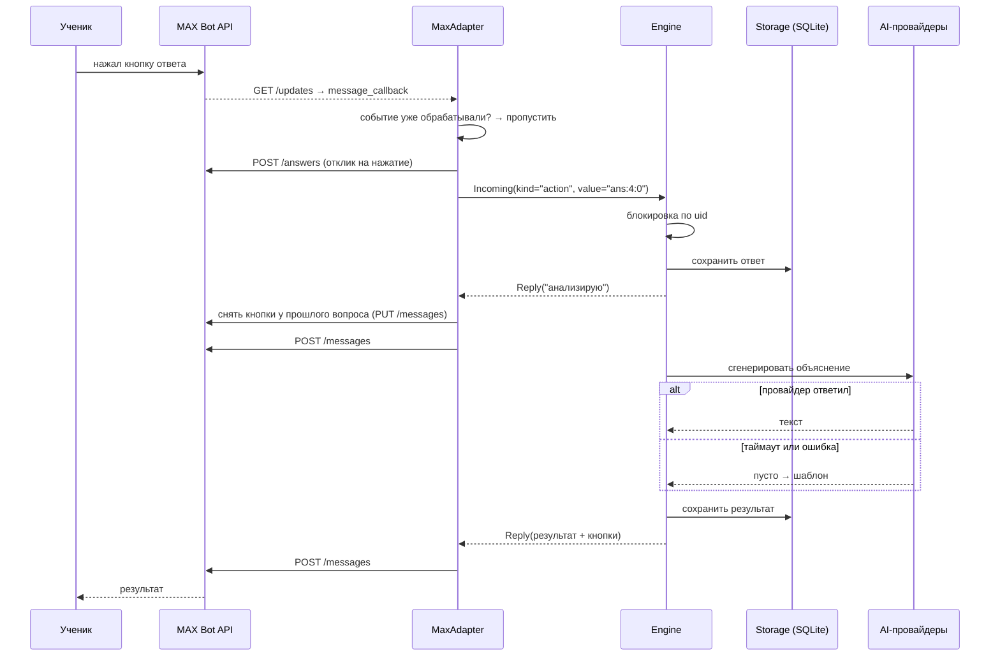
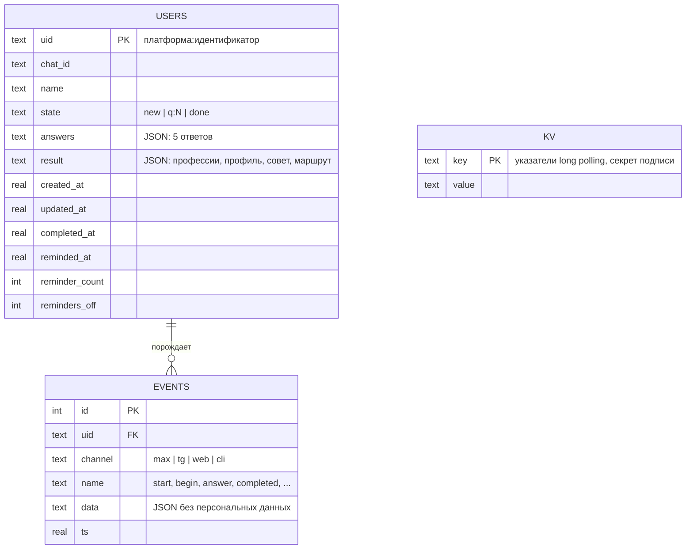
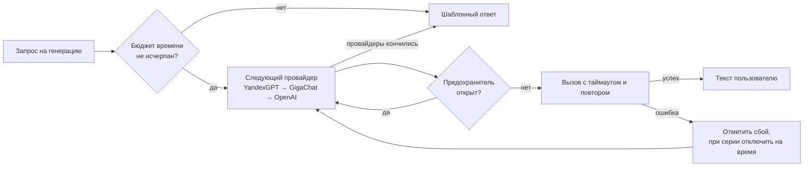

# Архитектура

## Границы

Между платформой и логикой стоят два объекта:

- `Incoming` — входящее событие: кто, откуда, что сделал (`start` / `text` / `action`);
- `Reply` — ответ бота: текст, кнопки, метаданные. Полей, специфичных для платформы, нет.

Адаптер переводит формат мессенджера в `Incoming`, движок возвращает `Reply`, адаптер рисует его средствами своей платформы. Поэтому один сценарий работает в MAX, Telegram, вебе и консоли, а новая платформа подключается отдельным файлом.

## Компоненты

| Модуль | Отвечает за | Не отвечает за |
|---|---|---|
| `adapters/base.py` | контракт адаптера, фоновые задачи, снятие устаревших клавиатур, отсев дублей | логику диалога |
| `adapters/max_bot.py` | MAX Bot API: опрос обновлений, клавиатуры, отправка, редактирование | что отвечать |
| `adapters/telegram_bot.py` | то же для Telegram Bot API | — |
| `adapters/web.py` | HTTP: чат, виджет, дашборд, плакат, `/health` | — |
| `core/engine.py` | сценарий: команды, вопросы, результат, маршрут, вопросы к ИИ | форматы платформ |
| `core/matching.py` | подбор 2 профессий и профиля олимпиады | тексты |
| `core/content.py` | вопросы, 8 профессий, 2 профиля, тексты | логику |
| `core/ai.py` | провайдеры, таймауты, повторы, circuit breaker | содержание промптов |
| `core/storage.py` | пользователи, события, служебные значения | бизнес-правила |
| `core/scheduler.py` | кто и когда получает напоминание | как его отправить |

## Блок-схема сценария

## Путь одного сообщения

Три свойства цепочки заданы намеренно:

1. Ответ и результат попадают в базу до обращения к сети — обрыв связи на выдаче результата не откатывает ученика назад.
2. `POST /messages` не повторяется при сетевой ошибке: ответ мог потеряться уже после доставки, и повтор дал бы дубль. Повторяются чтение обновлений и другие идемпотентные запросы; при 429 повтор безопасен, потому что сообщение точно не доставлено.
3. Блокировка по uid не даёт двум быстрым нажатиям выполниться одновременно.

## Модель данных

`uid` = `<платформа>:<идентификатор>`, поэтому один человек в MAX и в Telegram — разные профили, а веб-версия открывается по подписанной ссылке с тем же `uid`, что и мессенджер.

Аналитика целиком считается из `events`. Отдельных таблиц под метрики нет: новый разрез добавляется без изменения схемы.

## Отказоустойчивость ИИ

Худший исход — шаблонный текст того же смысла, помеченный в аналитике как `provider: template`.

## Точки расширения

| Задача | Что сделать | Где |
|---|---|---|
| Добавить мессенджер (VK, Сферум, школьный портал) | реализовать `run()` и `send_to_user()` | новый файл в `adapters/` |
| Добавить команду или кнопку | `engine.register_command()` / `register_action()` | без правки движка |
| Изменить вопросы, профессии, тексты | отредактировать структуры | `core/content.py` |
| Изменить правила подбора | таблица сочетаний и веса | `core/matching.py` |
| Добавить ИИ-провайдера | класс с `complete()` + запись в `PROVIDER_FACTORIES` | `core/ai.py` |
| Перейти на PostgreSQL | реализовать методы `Storage` | `core/storage.py` |
| Добавить метрику | новый разрез по `events` | `core/analytics.py` |

## Запуск

`main.py` поднимает выбранные адаптеры, веб-сервер и планировщик как независимые задачи под супервизором: упавший компонент перезапускается с задержкой, остальные продолжают работать. Без `MAX_TOKEN` адаптер MAX просто не поднимается, в лог пишется предупреждение.
